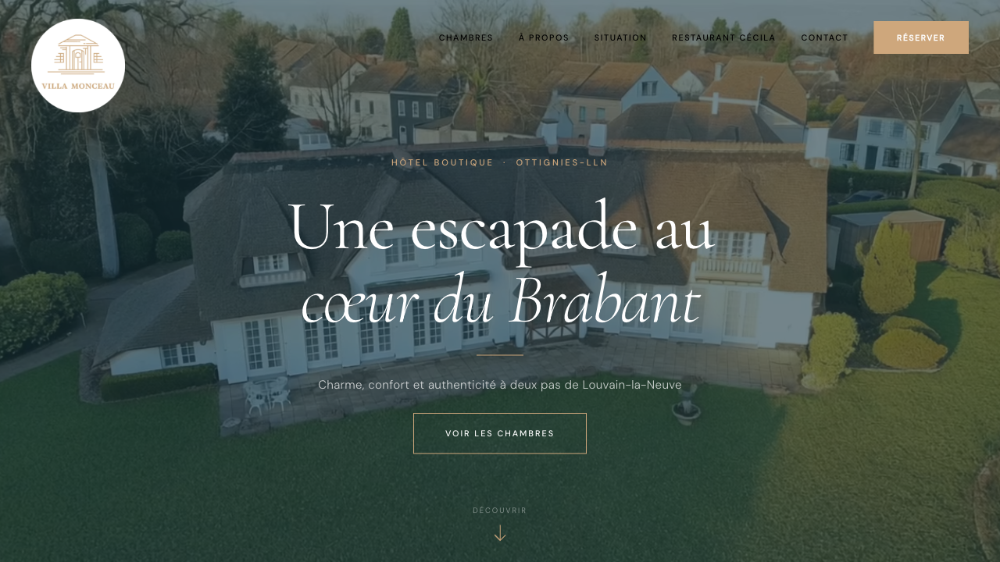
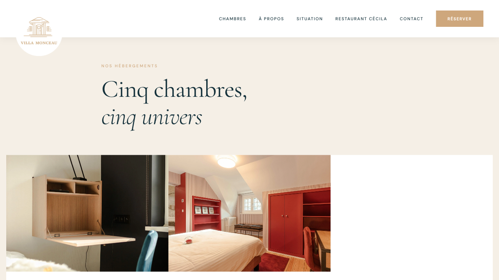
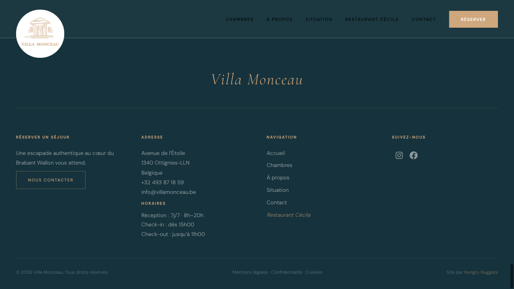

# Villa Monceau — WordPress FSE Block Theme

> Thème WordPress Full Site Editing (FSE) pour **[Villa Monceau](https://villamonceau.be)**, hôtel boutique au toit de chaume à Ottignies-LLN (Belgique).

---

## Screenshots

| Accueil | Chambres |
|--------|---------|
|  |  |

| Page chambre | Footer |
|-------------|--------|
|  |  |

---

## Caractéristiques

- **WordPress FSE** — theme.json v3, templates HTML, template parts
- **8 blocs custom** enregistrés via `block.json` + `render.php`
- **Style variation** "Nuit" (mode sombre élégant)
- **3 patterns** internes (hero, galerie, USP strip) — non-inserter
- **Palette cohérente** : vert sapin, or champagne, crème
- **Google Fonts** : Cormorant Garamond (titres) + Inter (corps)
- **Performance** : CSS custom minimal, pas de builder page

---

## Prérequis

| Logiciel | Version minimale |
|----------|-----------------|
| WordPress | 6.4 |
| PHP | 8.0 |
| Tested up to WP | 6.7 |

---

## Structure du thème

```
villa-monceau/
├── assets/
│   ├── css/
│   │   ├── custom.css       # Styles frontend custom
│   │   └── editor.css       # Styles éditeur FSE
│   └── js/
│       ├── main.js           # JS frontend
│       └── *-editor.js       # Scripts éditeur par bloc
│
├── blocks/                   # 8 blocs custom (block.json + render.php)
│   ├── chambre-meta/         # Métadonnées chambre (capacité, taille...)
│   ├── chambre-equipements/  # Liste équipements
│   ├── chambre-prix/         # Affichage prix
│   ├── chambre-lien-resa/    # Bouton réservation
│   ├── chambre-slider/       # Galerie photos chambre
│   ├── google-maps/          # Carte Google Maps
│   ├── icon/                 # Icône SVG custom
│   └── poi-grid/             # Grille points d'intérêt
│
├── parts/
│   ├── header.html           # En-tête global
│   └── footer.html           # Pied de page (socials, coords)
│
├── patterns/
│   ├── hero.php              # Hero homepage (Inserter: false)
│   ├── usp-strip.php         # Bande arguments clés (Inserter: false)
│   ├── gallery-strip.php     # Galerie défilante (Inserter: false)
│   ├── about.php             # Section À propos
│   ├── rooms.php             # Grille des chambres
│   ├── restaurant.php        # Section restaurant
│   ├── pois.php              # Points d'intérêt
│   └── location.php          # Section localisation + carte
│
├── templates/
│   ├── front-page.html       # Page d'accueil
│   ├── page.html             # Page standard
│   ├── page-contact.html     # Page contact
│   ├── page-legal.html       # Pages légales
│   ├── archive-chambre.html  # Liste chambres
│   └── single-chambre.html   # Page chambre individuelle
│
├── styles/
│   └── nuit.json             # Style variation dark mode
│
├── functions.php             # Enqueue assets + register blocks
├── style.css                 # Métadonnées thème WordPress
└── theme.json                # Paramètres globaux FSE v3
```

---

## Palette de couleurs

| Nom | Slug | Valeur |
|-----|------|--------|
| Vert sapin profond | `dark` | `#16323C` |
| Or champagne | `gold` | `#CEA77C` |
| Crème | `cream` | `#F5EFE6` |
| Blanc | `white` | `#FFFFFF` |
| Noir | `black` | `#1A1A1A` |

---

## Blocs custom

Les blocs sont enregistrés via `block.json` (standard WP 6.x) et rendus côté serveur par `render.php`. Pas de build step requis.

```php
// functions.php
add_action('init', function() {
    $blocks = ['chambre-meta', 'chambre-equipements', 'chambre-prix',
               'chambre-lien-resa', 'icon', 'chambre-slider',
               'google-maps', 'poi-grid'];
    foreach ($blocks as $block) {
        register_block_type(get_template_directory() . '/blocks/' . $block);
    }
});
```

---

## Style variation — Nuit

Un mode sombre disponible dans **Apparence > Éditeur > Styles**.

- Fond : `#16323C` (vert sapin)
- Texte : `#F5EFE6` (crème)
- Titres et liens : `#CEA77C` (or)

---

## Installation

1. Télécharger la dernière release (`villa-monceau-X.X.X.zip`)
2. WordPress Admin > **Apparence > Thèmes > Ajouter**
3. Téléverser le ZIP et activer

> **Note :** Ce thème est conçu pour le site Villa Monceau et ses Custom Post Types (`chambre`). Certains blocs nécessitent du contenu spécifique pour s'afficher correctement.

---

## Développement

Développé par **[Hungry Nuggets](https://hungrynuggets.com)** — Intégration WordPress, Ottignies-LLN.

- Site live : [villamonceau.be](https://villamonceau.be)
- Licence : GPL-2.0-or-later
